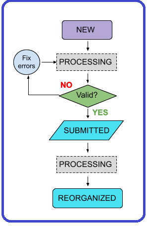

## Section 10 - Data Processing

Details about Ingestion Statuses 

### Ingestion Statuses 
These statuses display in the ingestion portal as a data set is processed.

|Data Upload Flow Diagram | Status | Explanation / Comments |
|:-------------------------------------:|:---------------------|:----------------------------------------------------|
|  | **New** | Data upload registered; Globus upload directory created.  Data provider has uploaded data. After HIVE (or CODCC) validation, status changes to <em>Submitted </em>when the data provider hits the submit button on the upload. <strong>Prerequisite: </strong>Local validation of data by provider prior to data upload.|
| | **Processing** |The data upload is being processed and is not editable. A transient state (between other states) while automated processes act on the upload.|
