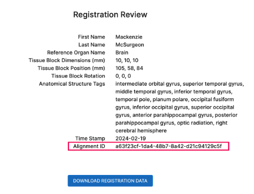

## Section 4 - RUI Tissue Blocks
When registering an organ (sample) on HuBMAP or SenNet which is supported in the Human Reference Atlas (HRA), you must register a tissue block for the sample with the HRA using the Registration User Interface (RUI).

**Accessing the RUI** - The RUI is embedded in the sample registration page.
- The RUI option only appears when registering a tissue block (sample) from a supported organ.
- Metadata such as author name, date, etc. is captured as part of the tissue ingest process.
- RUI data is automatically associated with the tissue block on Globus.

**RUI information requirements:**
- Tissue block length, width, and height dimensions (expressed in mm)
- Tissue block placement relative to a Human Reference Atlas 3D Reference Organ
- Entry of all anatomical structures that are a part of the tissue block

**Spatial Registration** - As of February 2022, the RUI supports HRA Tissue Block registration for more than 50 organs.
1. **Is your organ supported?** Open the <a href="https://hubmapconsortium.github.io/ccf-ui/rui/">standalone version of the RUI</a> and check the organ carousel.
2. **Gather materials needed** to document from where (in the subject) the tissue block was extracted.
3. **Open the RUI:** Open the relevant version of the RUI (standalone or ingest portal version).
   - The _Select an organ_ dialog displays when you browse to the RUI webpage.
   - If applicable, select the right or left version of the organ.

**NOTE:** For more detailed instructions, refer to the SOP: <a href="https://zenodo.org/record/6628366#.ZAYfdXbMJD8">Using the CCF Registration User Interface</a>.

**Donor sex and organ selection:**  
**Note:** Step 3 varies depending on whether you are using the "public" or HuBMAP's ingest portal version.
1. Enter the donor’s name.
2. Select the donor’s sex.
3. Organ selection (Varies based on the version you are using).  
_Public version_:
   - Click the picture of an organ to select it from the carousel.
   - The organ may take a few seconds to load.  
   
   _Ingest portal version_: The organ is pre-selected.
4. Click **Start Registration** to complete this step and display the CCF Registration page. 

### Tissue Placement
 **TIP:** First time using the RUI? Review the _Description of the User Interface (UI)_ section in the <a href="https://zenodo.org/record/6628366#.ZAYfdXbMJD8">SOP</a>.

**Adjusting opacity:** 
   - All anatomical structures are set to **20%** opacity by default.
   - This makes “looking inside” reference organs easier.
   - Use the _Anatomical Structures_ accordion menu in the left (metadata) pane to adjust the opacity.

**Resizing a tissue block**
   - Use the _Tissue Block Dimensions_ text input fields in the top right corner.
   - The default is a **10 x 10 x 10 mm** (L x W x H) block.
   - Enter tissue section thickness in millimeters.

**Moving a tissue block:** There are 3 methods for moving a tissue block into position.
   - **Mouse:** When using the mouse, the tissue block can only be moved in _two_ dimensions at a time.
   - **X, Y, Z axis sliders:** Adjust the rotation of the tissue block using the X, Y, Z axis sliders in the _right_ pane.
   - **A, D, W, S, Q, E keys:** Move the tissue block by pressing these keys on your keyboard.
        - Each key press moves the tissue block by **0.5 mm** in a positive or negative direction.
        - Each pair of keys represent a dimensional axis:
             - **A—D = X** axis
             - **W—S = Y** axis
             - **E—Q = Z** axis
        - This control method can be used in both the _Register_ and _3D Preview_ modes.

**Inspecting placed blocks:** Click the **Previously Registered Blocks** toggle button in the _left_ pane. 
   - This lets you inspect tissue blocks you placed before (for reference).
      - Click the toggle button to show all previously registered tissue blocks based on your browser’s local cache.
      - This feature is supported in most browsers.
   - **Radio buttons (3D pane):** Change the perspective using these radio buttons.
   - **3D Preview mode:** To verify placement, switch to this mode using the corresponding toggle switch at the top of the 3D pane.

**Register Location:** Review your registration data, then click the **Register Location** button.
   - Your data will be saved and shared and the _RUI window_ will close automatically.

### Tissue Registration Issues
In a number of scenarios, the user might have doubts about whether the tissue sample can or should be spatially registered. For example, the tissue might be missing some metadata or there might be a mismatch between tissue sample size and 3D reference size. With a few exceptions, the general guidance in such cases is to proceed with the registration process while documenting the missing information or issue.

In case your tissue sample is missing metadata or there is another issue that you would like to report: 
1. Open <a href="https://docs.google.com/forms/d/e/1FAIpQLSe0faIih0S-1zqn5FCdalCF7YTxK7ECMgg0svVv0dvlEF7gKQ/viewform">this Google Form</a> and select your issue from among the multiple choices. If your specific issue is not listed, select Other and describe it in brief
2. Based on your answer, the Form will either grant you an exemption or ask that you proceed with the registration process. The rest of the steps below assume the latter condition.
3. Make sure you document the issue in as much detail as possible in the Form.
4. *Without closing the Google Form*, proceed with entering tissue metadata as described in the <a href="https://docs.google.com/document/d/137yNId7DJBtt9xGccItC7jVAwz4FYALm_IIXD7e6_7A/edit#heading=h.jtxxdtmkcar2">Enter Metadata</a> section and placing the tissue as described in the <a href="https://docs.google.com/document/d/137yNId7DJBtt9xGccItC7jVAwz4FYALm_IIXD7e6_7A/edit#heading=h.ezmdrr41kbmq">Place Tissue</a> section.
5. When reviewing the registration data as described in the <a href="https://docs.google.com/document/d/137yNId7DJBtt9xGccItC7jVAwz4FYALm_IIXD7e6_7A/edit#heading=h.2linlxoj1erk">Review and Download Registration Data</a> section, copy and paste the Alignment ID in the Google Form.
6. Submit the Google Form and continue with the registration process.

Multiple Choices Referenced in Step 1

Where to Get the Alignment ID for Step 5

  

### Best Practices
Below is a list of best practices to ensure that the spatial registration process goes smoothly and the likelihood of errors is minimized:
- **Immediate Spatial Registration Post-Sectioning:** Prioritize conducting spatial registrations directly after sectioning tissue samples whenever possible. This approach helps preserve the accuracy of spatial information and minimizes morphological alterations that might occur over time.
- **Detailed Documentation of Extraction Site:** In scenarios where immediate spatial registration is impractical, carefully document the extraction site. Use photographs and detailed annotations on anatomical images to accurately capture the original location and orientation of the tissue. Such documentation can aid subsequent registration efforts.
- **Preserving Context:**
  -  For diseased tissue, clinical imaging, surgeon’s operative notes (if available), and pathology notes can provide insights into the specific characteristics and conditions of the tissue.
  -  For normal tissue, communication between the surgeon, the tissue collector, and the specimen collection manager can improve documentation accuracy and handling of tissue samples
- **Aligning Tissue Using Anatomical Landmarks:** The Anatomical Landmarks pane on the bottom left side of the RUI interface serves as a useful reference for orienting tissue samples and navigating reference organs.
- **Cross-Training on the RUI:** Ensure that multiple team members are trained in using the RUI to prevent processing bottlenecks. Having several proficient RUI users allows for continuity in work, even in the absence of key personnel.
